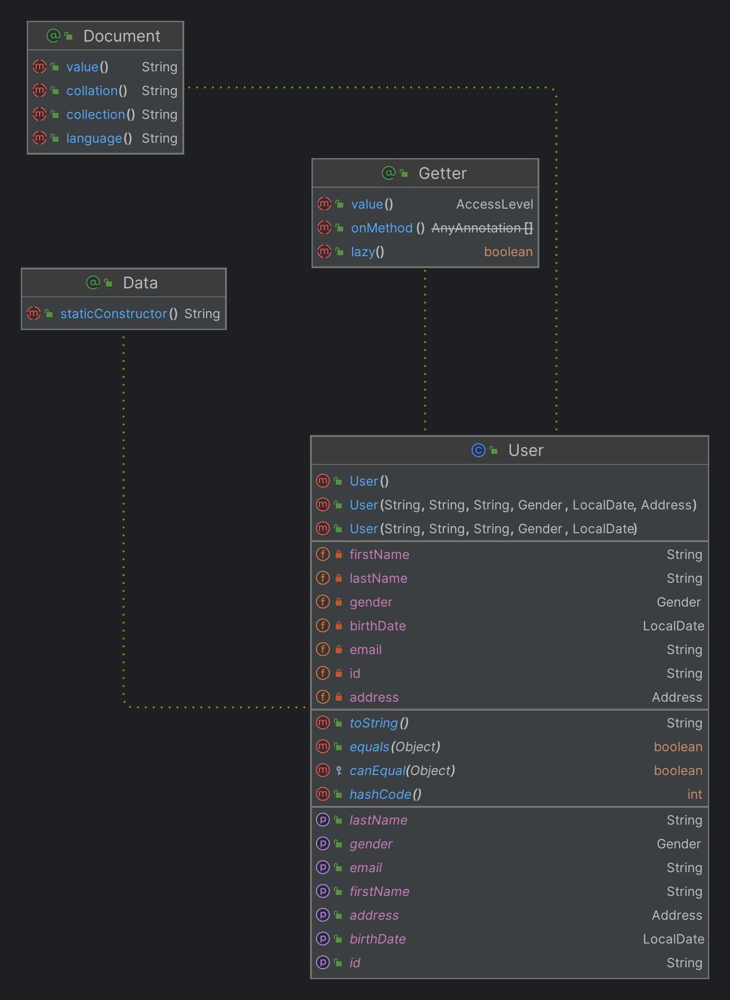

# Spring boot project

## Prerequisites

Have docker installed

## Running the Application

```sh
cd sp-project
./run.sh
```

## Swagger UI

Go to [Swagger UI](http://localhost:8080/swagger-ui.html)

## UML Diagram
This is the UML diagram of the project



